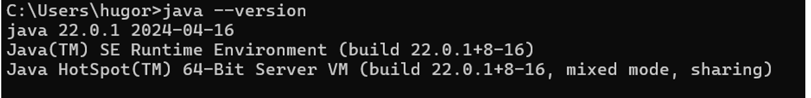
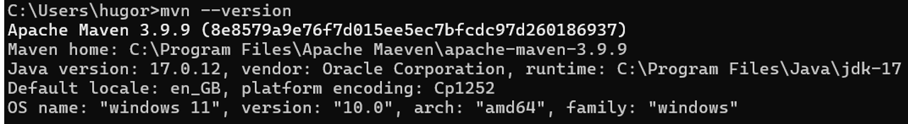
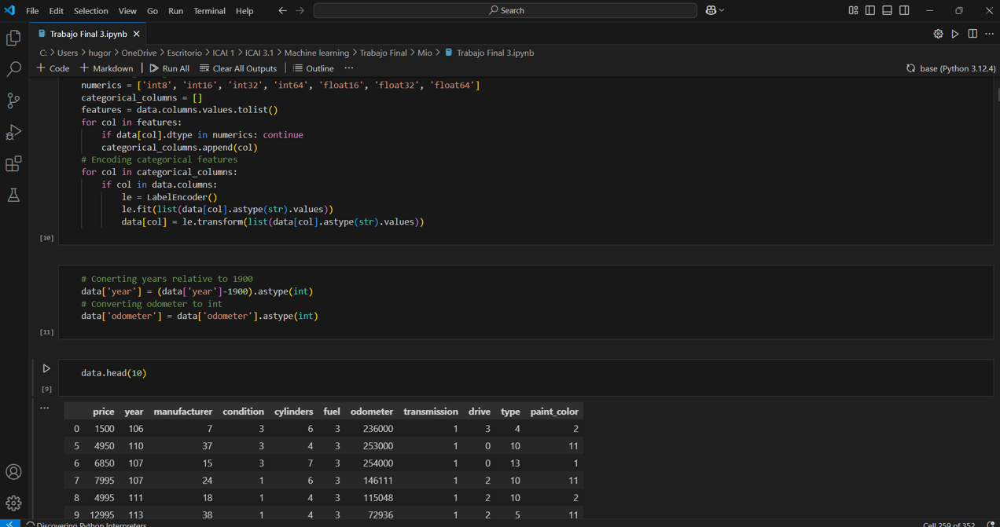

# Práctica 1: Comandos Git y Entorno de Desarrollo Java

## **Comandos Git**
Se utilizaron los siguientes comandos:

### 1. **`git clone`**
   - **Descripción**: Clona un repositorio remoto a tu máquina local.
   - **Uso**:
     ```bash
     git clone https://github.com/hugoragg/p1.git
     ```
   - **Log de consola**:
     ```
     Cloning into 'p1'...
     remote: Enumerating objects: 6, done.
     remote: Counting objects: 100% (1/1), done.
     remote: Total 6 (delta 0), reused 0 (delta 0), pack-reused 5 (from 1)
     Receiving objects: 100% (6/6), done.
     ...
     ```

### 2. **`git status`**
   - **Descripción**: Muestra el estado de los archivos en el repositorio local (modificados, nuevos, o listos para confirmar).
   - **Uso**:
     ```bash
     git status
     ```
   - **Log de consola**:
     ```
     On branch main
     Your branch is up to date with 'origin/main'.
     ```

### 3. **`git add`**
   - **Descripción**: Agrega archivos al área de preparación para confirmarlos.
   - **Uso**:
     ```bash
     git add git.txt
     ```
   - **Log de consola**:
     *(No se mostró salida en este caso)*

### 4. **`git commit`**
   - **Descripción**: Confirma los cambios realizados en el repositorio local.
   - **Uso**:
     ```bash
     git commit -m "Añadido git.txt con descripción de comandos"
     ```
   - **Log de consola**:
     ```
     [main 5e6405e] Añadido archivo con explicaciones de comandos Git
     1 file changed, 1 insertion(+)
     create mode 100644 git.txt
     ```

### 5. **`git push`**
   - **Descripción**: Sube los cambios confirmados al repositorio remoto.
   - **Uso**:
     ```bash
     git push
     ```
   - **Log de consola**:
     ```
     Enumerating objects: 4, done.
     Counting objects: 100% (4/4), done.
     Delta compression using up to 2 threads
     Compressing objects: 100% (2/2), done.
     Writing objects: 100% (3/3), 337 bytes | 337.00 KiB/s, done.
     Total 3 (delta 0), reused 0 (delta 0), pack-reused 0
     To https://github.com/hugoragg/p1.git
     07720b5..5e6405e  main -> main
     ...
     ```

### 6. **`git checkout`**
   - **Descripción**: Cambia entre ramas o versiones específicas del código.
   - **Uso**:
     ```bash
     git checkout -b nueva-rama
     ```
   - **Log de consola**:
     ```
     Switched to a new branch 'nueva_rama'
     ```

---
## Configuración del Entorno de Desarrollo Java
Se instaló el software necesario para trabajar con Java y Maven, y se verificó su correcto funcionamiento.

### 1. **Java 17**
- **Instalación**: Se descargó e instaló desde [Oracle]
- **Verificación**:
  ```bash
  java --version
  ```
  **Log de consola**:
     ```
    "java 22.0.1 2024-04-16
    Java(TM) SE Runtime Environment (build 22.0.1+8-16)
    Java HotSpot(TM) 64-Bit Server VM (build 22.0.1+8-16, mixed mode, sharing)"
     ```
### 2. **Maeven**
- **Instalación**: Se descargó desde Apache Maven y se configuraron las variables de entorno MAVEN_HOME y PATH
- **Verificación**:
  ```bash
  mvn --version
  ```
  **Log de consola**:
     ```
    "Apache Maven 3.9.9 (8e8579a9e76f7d015ee5ec7bfcdc97d260186937)
    Maven home: C:\Program Files\Apache Maeven\apache-maven-3.9.9
    Java version: 17.0.12, vendor: Oracle Corporation, runtime: C:\Program Files\Java\jdk-17
    Default locale: en_GB, platform encoding: Cp1252
    OS name: "windows 11", version: "10.0", arch: "amd64", family: "windows""
     ```
### 3. **VSCode**
- **Instalación**: Ya instalado con anterioridad

### 4. **Inteliji**
- **Instalación**: Ya instalado con anterioridad

### Capturas de Pantalla

- **Java**:
  

- **Maven**:
  

- **Visual Studio Code**:
  

- **IntelliJ IDEA**:
  

